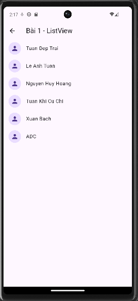
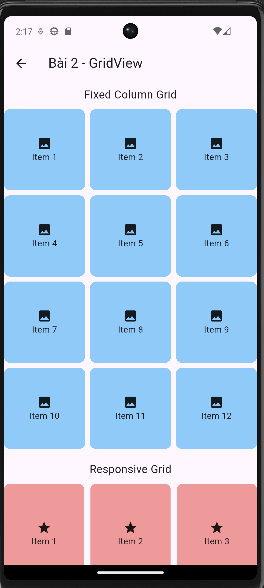
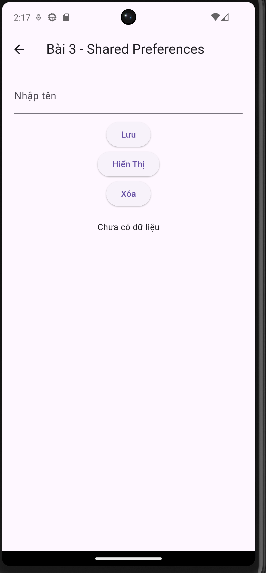
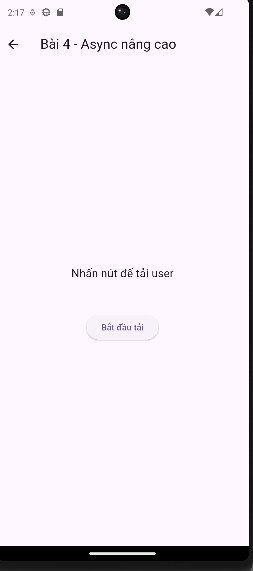

Tên : Lê Anh Tuấn 
MSSV : 2224801030317

# 📱 Bài Tập Flutter Tuần 4

Repo này lưu lại các bài tập Flutter tuần 4 theo yêu cầu môn học.  
Mỗi bài được đặt trong `lib/pages/` và thể hiện một chủ đề quan trọng trong lập trình Flutter.

Dưới đây là mô tả chi tiết và ảnh minh họa cho từng bài.

---

# 🧩 1. ListView

Hiển thị danh sách các tên với avatar và tiêu đề.  
Sử dụng `ListView.builder` để tạo danh sách động.

### 📸 Demo

---

# 🧩 2. GridView

Sử dụng `GridView.count` và `GridView.extent`.  
Hiển thị 12 phần tử với tỉ lệ khung hình và khoảng cách hợp lý.

### 📸 Demo

---

# 🧩 3. Shared Preferences

Lưu và hiển thị lại tên người dùng bằng `SharedPreferences`.  
Cho phép nhập tên, lưu lại và hiển thị lại khi mở app.  
Có nút xóa dữ liệu.

### 📸 Demo

---

# 🧩 4. Async / Future

Hiển thị text `"Loading user..."` trong 3 giây rồi đổi thành `"User loaded successfully!"`.  
Có hiệu ứng loading và nút bắt đầu.

### 📸 Demo

---

# 🧩 5. Isolate

Dùng `compute` để tính giai thừa lớn (ví dụ: 30000!) mà không làm treo UI.  
Có thanh loading và vùng hiển thị kết quả.

### 📸 Demo

---

# 📂 Cấu trúc thư mục

